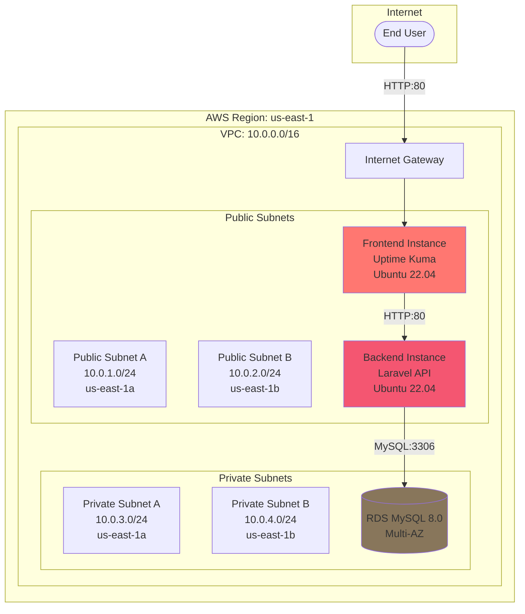
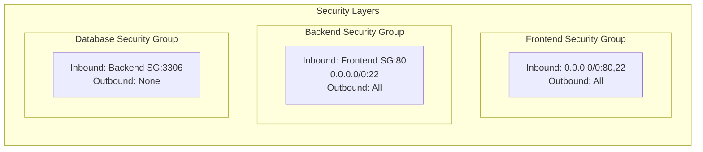

# Obelion Cloud Infrastructure and CI/CD Automation

This repository contains production-ready Infrastructure as Code (Terraform) and Continuous Integration/Continuous Deployment (CI/CD) automation using GitHub Actions for a secure, scalable 2-tier web application architecture on Amazon Web Services.

## Table of Contents
- [Architecture Overview](#architecture-overview)
- [Infrastructure Components](#infrastructure-components)
- [Repository Structure](#repository-structure)
- [Prerequisites](#prerequisites)
- [Deployment Guide](#deployment-guide)
- [CI/CD Pipeline](#cicd-pipeline)
- [Security Configuration](#security-configuration)
- [Monitoring](#monitoring)
- [Application Details](#application-details)
- [Screenshots](#screenshots)
- [Troubleshooting](#troubleshooting)

## Architecture Overview

### High-Level Architecture


### Network Security Architecture


## Infrastructure Components

### Networking
- **VPC**: Custom VPC with CIDR block 10.0.0.0/16
- **Subnets**:
  - 2 Public Subnets across 2 Availability Zones (us-east-1a, us-east-1b)
  - 2 Private Subnets across 2 Availability Zones
- **Internet Gateway**: Enables internet connectivity for public subnets
- **Route Tables**: Separate route tables for public and private subnets

### Compute (EC2)
- **Frontend Instance**: 
  - Ubuntu 22.04 LTS
  - Hosts Uptime Kuma monitoring application
  - Docker and Docker Compose installed
  - Deployed in public subnet
  
- **Backend Instance**:
  - Ubuntu 22.04 LTS
  - Laravel PHP 8.3 application
  - Apache2 web server
  - Composer for dependency management
  - Deployed in public subnet

### Database (RDS)
- **Engine**: MySQL 8.0
- **Deployment**: Multi-AZ for high availability
- **Storage**: Encrypted using AWS KMS
- **Subnet Group**: Spans private subnets across multiple AZs
- **Backup**: Automated backups enabled

### Security
- **KMS**: Encryption keys for RDS and Secrets Manager
- **Secrets Manager**: Secure storage of database credentials
- **IAM Roles**: Least privilege access for EC2 instances to access secrets
- **Security Groups**: Layered security controls for each tier

### Monitoring
- **CloudWatch**: 
  - CPU utilization alarms for EC2 instances
  - Automated notifications via SNS
- **SNS**: Email notifications for critical alerts

## Repository Structure

```
Obelion-Cloud-Assessment/
├── terraform/
│   ├── environments/
│   │   └── dev/
│   │       ├── main.tf              # Root module orchestration
│   │       ├── variables.tf         # Input variables
│   │       ├── outputs.tf           # Output values
│   │       └── backend.tf           # Backend configuration
│   └── modules/
│       ├── network/                 # VPC, subnets, IGW, route tables
│       ├── ec2/                     # EC2 instances and security groups
│       │   ├── ami.tf              # AMI data source
│       │   ├── frontend.tf         # Frontend instance
│       │   ├── backend.tf          # Backend instance
│       │   └── sg.tf               # Security groups
│       ├── rds/                     # RDS database configuration
│       ├── kms_and_secrets_manager/ # KMS keys and secrets
│       ├── cloudwatch/              # CloudWatch alarms and SNS
│       └── iam/                     # IAM roles and policies
├── apps/
│   ├── Frontend/
│   │   └── deploy(frontend).yml    # Frontend CI/CD pipeline
│   └── Backend/
│       └── deploy(backend).yml      # Backend CI/CD pipeline
└── imgs/                            # Screenshots and diagrams
```

## Prerequisites

### Required Tools
- Terraform >= 1.0.0
- AWS CLI configured with appropriate credentials
- SSH key pair for EC2 access
- Git

### AWS Permissions
The AWS IAM user/role must have permissions to create:
- VPC, Subnets, Route Tables, Internet Gateway
- EC2 Instances, Security Groups
- RDS Instances, DB Subnet Groups
- KMS Keys, Secrets Manager secrets
- CloudWatch Alarms, SNS Topics
- IAM Roles and Policies

## Deployment Guide

### Step 1: Infrastructure Provisioning

1. Clone this repository:
```bash
git clone https://github.com/Ahmedheggy/Terraform-Script-Obelion-Cloud-Automation-Assessment.git
cd Obelion-Cloud-Assessment/terraform/environments/dev
```

2. Initialize Terraform:
```bash
terraform init
```

3. Review the planned changes:
```bash
terraform plan
```

4. Apply the configuration:
```bash
terraform apply
```

5. Note the outputs:
```
Outputs:
frontend_public_ip = "54.xxx.xxx.xxx"
backend_public_ip = "18.xxx.xxx.xxx"
db_endpoint = "terraform-xxxxxxx.xxxxxxx.us-east-1.rds.amazonaws.com"
```

### Step 2: Application Deployment

#### Frontend Application (Uptime Kuma)
The frontend is automatically deployed via the EC2 user_data script which:
1. Installs Docker and Docker Compose
2. Sets up the application directory at `/opt/uptime-kuma`
3. Waits for CI/CD pipeline to deploy the application

**Repository**: https://github.com/Ahmedheggy/uptime-kuma.git

Access the frontend at: `http://<frontend_public_ip>`

#### Backend Application (Laravel)
The backend is automatically provisioned with:
1. PHP 8.3 and required extensions
2. Composer (latest version)
3. Apache2 web server

The application code is deployed via GitHub Actions.

**Repository**: https://github.com/Ahmedheggy/laravel.git

## CI/CD Pipeline

### Frontend Workflow

**Trigger**: Push to `main` branch

**Workflow File**: `apps/Frontend/deploy(frontend).yml`

**Pipeline Stages**:
1. **Build**: Validation and preparation
2. **Deploy**:
   - Copy docker-compose.yml to the server via SCP
   - SSH into the Frontend instance
   - Modify port mapping (3001 → 80)
   - Pull the latest Docker image
   - Restart containers using docker-compose

### Backend Workflow

**Trigger**: Push to `main` branch

**Workflow File**: `apps/Backend/deploy(backend).yml`

**Pipeline Stages**:
1. **Deploy**:
   - SSH into Backend instance
   - Pull latest code changes from repository
   - Create/update `.env` file with database secrets
   - Install dependencies via Composer
   - Run database migrations

### Required GitHub Secrets

#### Frontend Repository Secrets:
- `SSH_HOST`: Frontend instance public IP
- `SSH_USER`: ubuntu
- `SSH_PRIVATE_KEY`: Private key content for SSH access

#### Backend Repository Secrets:
- `SSH_HOST`: Backend instance public IP
- `SSH_USER`: ubuntu
- `SSH_PRIVATE_KEY`: Private key content for SSH access
- `DB_HOST`: RDS endpoint
- `DB_NAME`: Database name
- `DB_USERNAME`: Database username
- `DB_PASSWORD`: Database password

## Security Configuration

### Defense in Depth

1. **Network Layer**:
   - Private subnets for RDS instances
   - Public subnets for application tiers with controlled ingress
   
2. **Security Groups**:
   - Frontend SG: Allows HTTP (80) and SSH (22) from anywhere
   - Backend SG: Allows HTTP (80) only from Frontend SG, SSH from anywhere
   - Database SG: Allows MySQL (3306) only from Backend SG

3. **Encryption**:
   - RDS storage encrypted using AWS KMS
   - Database credentials stored in AWS Secrets Manager

4. **Identity & Access**:
   - IAM roles with least privilege access
   - EC2 instances can only access specific secrets

### Security Best Practices

- ✅ All data encrypted at rest (RDS, Secrets Manager)
- ✅ Least privilege IAM policies
- ✅ Multi-AZ deployment for database high availability
- ✅ Security groups following principle of least privilege
- ✅ Secrets stored in AWS Secrets Manager, not in code

## Monitoring

### CloudWatch Alarms
- **CPU Utilization**: Alerts when EC2 instances exceed 80% CPU
- **Instance Health**: Monitors EC2 instance status checks

### SNS Notifications
- Email notifications configured for all CloudWatch alarms
- Subscription requires email confirmation

### Application Monitoring
- **Uptime Kuma**: Provides real-time monitoring of the Laravel backend
- **Dashboard**: Visual representation of service health and response times

## Application Details

### Frontend: Uptime Kuma
Uptime Kuma is a self-hosted monitoring tool similar to "Uptime Robot":
- **Features**:
  - Real-time monitoring dashboard
  - HTTP/HTTPS monitoring
  - Response time tracking
  - Uptime percentage calculation
  - Alert notifications
- **Access**: HTTP on port 80
- **Storage**: SQLite database

### Backend: Laravel API
Laravel is a modern PHP framework for web applications:
- **Version**: PHP 8.3
- **Framework**: Laravel (latest)
- **Database**: MySQL via RDS
- **Web Server**: Apache2
- **Features**: RESTful API endpoints

## Screenshots

### 1. Uptime Kuma Database Configuration
Initial database setup screen for Uptime Kuma.


### 2. Monitor Dashboard
Clean dashboard interface showing monitor status summary.


### 3. Adding Laravel Backend Monitor
Configuration screen for adding a new HTTP monitor pointing to the Laravel backend API.


### 4. Monitoring Success
Successful monitoring showing the Laravel backend is up with uptime and response time metrics.


### 5. CloudWatch Monitoring
CloudWatch dashboard showing EC2 instance metrics and alarms.


## Troubleshooting

### Common Issues

**Issue**: Terraform apply fails with subnet group error
```
Error: DB Subnet Group doesn't meet availability zone coverage requirement
```
**Solution**: Ensure at least 2 subnets in different AZs are specified in the RDS subnet group configuration.

---

**Issue**: Frontend application not accessible
**Solution**: 
1. Check security group allows inbound traffic on port 80
2. Verify instance is running: `terraform output frontend_instance_id`
3. SSH into instance and check Docker containers: `sudo docker-compose ps`

---

**Issue**: Backend cannot connect to database
**Solution**:
1. Verify RDS security group allows traffic from backend security group on port 3306
2. Check `.env` file has correct database credentials
3. Verify RDS endpoint: `terraform output db_endpoint`

---

**Issue**: GitHub Actions deployment fails
**Solution**:
1. Verify all required secrets are configured in GitHub repository settings
2. Check SSH key has proper permissions (no passphrase)
3. Verify instance IPs match the secrets

### Useful Commands

```bash
# SSH into frontend instance
ssh -i /path/to/key.pem ubuntu@<frontend_public_ip>

# SSH into backend instance
ssh -i /path/to/key.pem ubuntu@<backend_public_ip>

# Check Docker containers on frontend
sudo docker-compose ps
sudo docker-compose logs -f

# Check Laravel logs on backend
tail -f ~/app/storage/logs/laravel.log

# Test database connectivity from backend
mysql -h <rds_endpoint> -u <username> -p

# View Terraform state
terraform show

# Destroy all infrastructure (careful!)
terraform destroy
```

## License

This project is part of the Obelion Cloud Assessment.

## Author

**Ahmed Hany**
- GitHub: [@Ahmedheggy](https://github.com/Ahmedheggy)

## Repository Links

- **Infrastructure Repository**: https://github.com/Ahmedheggy/Terraform-Script-Obelion-Cloud-Automation-Assessment
- **Frontend Repository**: https://github.com/Ahmedheggy/uptime-kuma
- **Backend Repository**: https://github.com/Ahmedheggy/laravel
