# 🚀 Obelion Cloud Infrastructure & CI/CD

> Infrastructure as Code (Terraform) and CI/CD automation for a secure, scalable 2-tier web application on AWS.

## 📋 Quick Navigation
[Architecture](#-architecture) • [Infrastructure](#️-infrastructure) • [Deployment](#-deployment) • [CI/CD](#-cicd-pipeline) • [Security](#-security) • [Monitoring](#-monitoring) • [Screenshots](#-screenshots)

---

## 🏗️ Architecture

```mermaid
graph LR
    User([👤 User]) -->|HTTP| Frontend
    Frontend[🖥️ Frontend<br/>Uptime Kuma<br/>Port 80] -->|Monitor| Backend
    Backend[⚙️ Backend<br/>Laravel API<br/>Port 8000] -->|Query| Database
    Database[(💾 RDS MySQL<br/>Multi-AZ<br/>Port 3306)]
    
    CloudWatch[📊 CloudWatch] -.->|Monitor| Frontend
    CloudWatch -.->|Monitor| Backend
    CloudWatch -->|Alert| SNS[📧 SNS Email]
    
    style Frontend fill:#4A90E2,stroke:#2E5C8A,color:#fff
    style Backend fill:#E27D60,stroke:#A85544,color:#fff
    style Database fill:#58A55C,stroke:#3D7340,color:#fff
    style CloudWatch fill:#F4A261,stroke:#C17E4D,color:#fff
    style SNS fill:#E76F51,stroke:#B34F3A,color:#fff
```



---

## 🛠️ Infrastructure

<table>
<tr>
<td width="50%">

### 🌐 Network
- **VPC**: `10.0.0.0/16`
- **Public Subnets**: 2 AZs (us-east-1a/b)
- **Private Subnets**: 2 AZs (us-east-1a/b)
- **IGW**: Internet connectivity

### 💻 Compute (EC2)
**Frontend** (Ubuntu 22.04)
- Uptime Kuma monitoring
- Docker & Docker Compose
- Public subnet (us-east-1a)

**Backend** (Ubuntu 22.04)
- Laravel PHP 8.3 API
- Apache2 web server
- Public subnet (us-east-1b)

</td>
<td width="50%">

### 🗄️ Database (RDS)
- **Engine**: MySQL 8.0
- **Deployment**: Multi-AZ
- **Storage**: 20GB
- **Backup**: 7 days retention
- **Location**: Private subnets

### 🔐 Security & Monitoring
- Secrets Manager (DB credentials)
- IAM roles (least privilege)
- Security Groups (layered)
- CloudWatch alarms (CPU 50%)
- SNS email notifications

</td>
</tr>
</table>

### 📁 Repository Structure
```
Obelion-Cloud-Assessment/
├── terraform/
│   ├── environments/dev/        # Terraform configs (main, variables, outputs)
│   └── modules/                 # network, ec2, rds, cloudwatch, iam, kms
├── apps/
│   ├── Frontend/                # deploy(frontend).yml
│   └── Backend/                 # deploy(backend).yml
└── imgs/                        # Screenshots
```

---

## 🚀 Deployment

### Prerequisites
```bash
# Required
- Terraform >= 1.0.0
- AWS CLI (configured)
- SSH key pair
- Git
```

### Quick Start
```bash
# 1. Clone repository
git clone https://github.com/Ahmedheggy/Obelion-Cloud-Assessment.git
cd Obelion-Cloud-Assessment/terraform/environments/dev

# 2. Initialize & Deploy
terraform init
terraform plan
terraform apply

# 3. Get outputs
terraform output
```

**Outputs:**
- `frontend_public_ip` - Access Uptime Kuma
- `backend_public_ip` - Laravel API endpoint
- `db_endpoint` - RDS MySQL endpoint

### Applications

| Application | Description | Repository | Access |
|------------|-------------|------------|--------|
| **Frontend** | Uptime Kuma monitoring tool | [uptime-kuma](https://github.com/Ahmedheggy/uptime-kuma) | `http://<frontend_ip>` |
| **Backend** | Laravel PHP API | [laravel](https://github.com/Ahmedheggy/laravel) | Deployed via GitOps |

---

## 🔄 CI/CD Pipeline

### Frontend Workflow
**Trigger:** Push to `main` → **File:** `apps/Frontend/deploy(frontend).yml`


**GitHub Secrets:** `SSH_HOST`, `SSH_USER`, `SSH_PRIVATE_KEY`

### Backend Workflow
**Trigger:** Push to `main` → **File:** `apps/Backend/deploy(backend).yml`


**GitHub Secrets:** `SSH_HOST`, `SSH_USER`, `SSH_PRIVATE_KEY`, `DB_HOST`, `DB_NAME`, `DB_USERNAME`, `DB_PASSWORD`

---

## 🔐 Security

### Defense in Depth

| Layer | Configuration |
|-------|---------------|
| **Network** | Private subnets for RDS, public for apps |
| **Frontend SG** | HTTP (80), SSH (22) from `0.0.0.0/0` |
| **Backend SG** | HTTP (8000) from Frontend SG only, SSH from `0.0.0.0/0` |
| **Database SG** | MySQL (3306) from Backend SG only |
| **Secrets** | Secrets Manager for DB credentials |
| **IAM** | Least privilege roles for EC2 → Secrets access |

**Best Practices:** ✅ Multi-AZ database ✅ Isolated subnets ✅ No hardcoded secrets ✅ Least privilege access

---

## 📊 Monitoring

**CloudWatch Alarms:**
- CPU > 50% → SNS email alert
- Instance health checks

**Uptime Kuma:**
- Real-time dashboard
- HTTP/HTTPS monitoring
- Response time tracking
- Uptime percentage

---

## 📸 Screenshots

<table>
<tr>
<td width="50%">

### Uptime Kuma DB Config


### Monitor Dashboard


</td>
<td width="50%">

### Adding Laravel Monitor


### Monitoring Success


</td>
</tr>
<tr>
<td colspan="2">

### CloudWatch Monitoring


</td>
</tr>
</table>

---

## 🔧 Troubleshooting

<details>
<summary><b>Terraform: Subnet group AZ coverage error</b></summary>

Ensure RDS subnet group has ≥2 subnets in different AZs.
</details>

<details>
<summary><b>Frontend not accessible</b></summary>

```bash
# Check security group port 80
terraform output frontend_instance_id
ssh ubuntu@<frontend_ip> "sudo docker-compose ps"
```
</details>

<details>
<summary><b>Backend DB connection failed</b></summary>

```bash
# Verify security group allows 3306 from backend
# Check .env credentials
terraform output db_endpoint
```
</details>

<details>
<summary><b>GitHub Actions deployment fails</b></summary>

- Verify all secrets configured in repository settings
- SSH key must have no passphrase
- IP addresses match terraform outputs
</details>

### Useful Commands
```bash
# SSH access
ssh -i key.pem ubuntu@<ip>

# Docker logs (frontend)
sudo docker-compose logs -f

# Laravel logs (backend)
tail -f ~/app/storage/logs/laravel.log

# Test DB connection
mysql -h <rds_endpoint> -u <user> -p

# Terraform operations
terraform show
terraform destroy  # ⚠️ Careful!
```

---

## 📚 Resources

**Repositories:**
- [Infrastructure (This repo)](https://github.com/Ahmedheggy/Terraform-Script-Obelion-Cloud-Automation-Assessment)
- [Frontend - Uptime Kuma](https://github.com/Ahmedheggy/uptime-kuma)
- [Backend - Laravel](https://github.com/Ahmedheggy/laravel)

**License:** Obelion Cloud Assessment Project

---

<div align="center">
<b>Built with ❤️ using Terraform, Docker, GitHub Actions</b>
</div>
