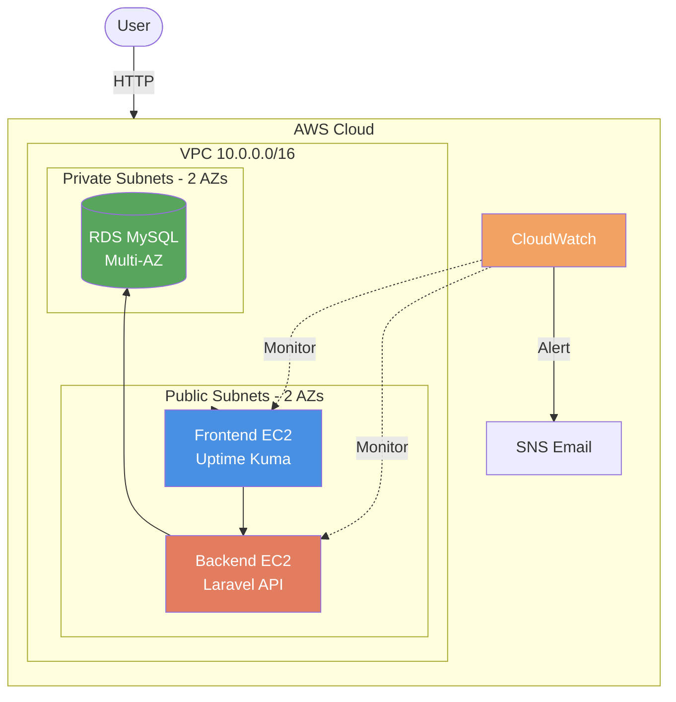

# Terraform Infrastructure

Infrastructure as Code for deploying a 2-tier web application on AWS.

## Architecture




## Prerequisites

- Terraform >= 1.0.0
- AWS CLI configured with credentials
- AWS SSH key pair created
- S3 bucket: `terraform-state-obelion-ahmed`

## Quick Start

### 1. Navigate to Environment

```bash
cd environments/dev
```

### 2. Set Required Variables

Create `terraform.tfvars` file:

```hcl
ssh_key_name     = "your-key-name"
allowed_ssh_cidr = "0.0.0.0/0"
db_password      = "SecurePassword123!"
email            = "your-email@example.com"
```

Or use command line:

```bash
terraform apply \
  -var="ssh_key_name=your-key" \
  -var="allowed_ssh_cidr=0.0.0.0/0" \
  -var="db_password=SecurePass123" \
  -var="email=you@example.com"
```

### 3. Deploy

```bash
terraform init
terraform plan
terraform apply
```

### 4. Get Outputs

```bash
terraform output
```

## Required Variables

| Variable | Description | Example |
|----------|-------------|---------|
| `ssh_key_name` | AWS SSH key pair name | `my-aws-key` |
| `allowed_ssh_cidr` | CIDR for SSH access | `0.0.0.0/0` or `YOUR_IP/32` |
| `db_password` | Database password (min 8 chars) | `SecurePass123!` |
| `email` | Email for CloudWatch alerts | `admin@example.com` |

## Optional Variables

All have defaults, override if needed:

```hcl
aws_region           = "us-east-1"        # AWS Region
environment          = "dev"              # Environment name
instance_type        = "t3.micro"         # EC2 instance type
vpc_cidr             = "10.0.0.0/16"      # VPC CIDR block
public_subnets_cidr  = ["10.0.1.0/24", "10.0.2.0/24"]
private_subnets_cidr = ["10.0.3.0/24", "10.0.4.0/24"]
azs                  = ["us-east-1a", "us-east-1b"]
```

## Outputs

| Output | Description |
|--------|-------------|
| `frontend_public_ip` | Access Uptime Kuma: `http://<IP>` |
| `backend_public_ip` | Laravel backend IP |
| `db_endpoint` | MySQL connection endpoint |
| `vpc_id` | VPC ID |
| `sns_topic_arn` | SNS topic for alerts |

## Infrastructure Components

- **Network**: VPC (10.0.0.0/16), 2 public + 2 private subnets across 2 AZs
- **Compute**: Frontend (Uptime Kuma) + Backend (Laravel) EC2 instances
- **Database**: MySQL 8.0 RDS Multi-AZ in private subnets
- **Security**: Security Groups, KMS, Secrets Manager, IAM roles
- **Monitoring**: CloudWatch alarms (CPU 50%) + SNS email notifications

## Common Commands

```bash
# Show .tf files 
terraform fmt -recursive

# Validate configuration
terraform validate

# Show current state
terraform show

# Destroy infrastructure
terraform destroy
```

## Structure

```
terraform/
├── environments/dev/   # Main entry point
│   ├── main.tf         # Module orchestration
│   ├── variables.tf    # Input variables
│   ├── outputs.tf      # Outputs
│   └── backend.tf      # S3 state backend
└── modules/            # Reusable modules
    ├── network/        # VPC, subnets, IGW
    ├── ec2/            # EC2 + security groups
    ├── rds/            # MySQL database
    ├── cloudwatch/     # Monitoring
    ├── kms_and_secrets_manager/
    └── iam/            # IAM roles
```

## Troubleshooting

**No valid credentials:**
```bash
aws configure
```

**SSH key not found:**
```bash
aws ec2 describe-key-pairs
```

**S3 bucket not found:**
Update `backend.tf` with your bucket name or create:
```bash
aws s3 mb s3://terraform-state-obelion-ahmed
```

## Security Notes

- Database password stored in AWS Secrets Manager (encrypted)
- Never commit `terraform.tfvars` to git (already in .gitignore)
- SNS subscription requires email confirmation
- State file stored in S3 backend
